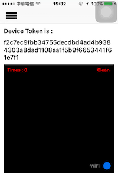

## USE KIT

- [AFNetworking 3.0](http://cocoadocs.org/docsets/AFNetworking/3.0.4/)
- [slideMenu](https://github.com/jhaoheng/slideMenu_ios)

## TODO

- 手動增加 api 位置
- 透過 api 傳送 token or 傳送 mail 給用戶

## view

